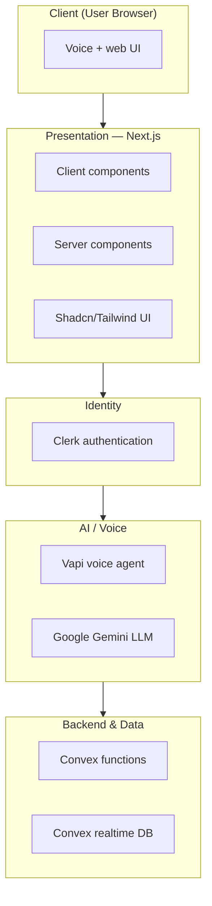
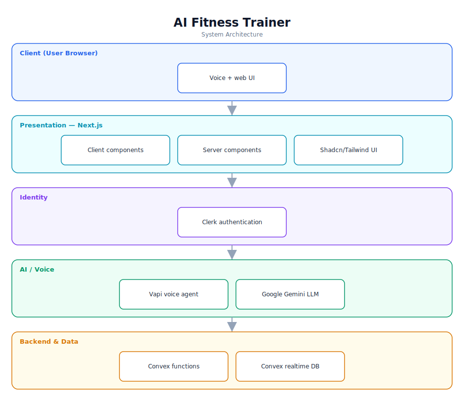

# AI Fitness Trainer — Software Documentation

> Generate personalised workout and diet programs through a conversational voice AI.

**Repository:** [`ai-fitness-trainer`](https://github.com/Monametsi-s/ai-fitness-trainer)  
**Type:** Full-stack web application  
**Status:** Complete / functional

---

## 1. Overview

AI Fitness Trainer is a Next.js application that generates personalised fitness and nutrition programs. Users converse with a voice assistant that gathers their goals, physical condition, and dietary constraints; a large language model then produces a tailored plan that is stored per user and rendered in the dashboard. Authentication is handled by Clerk, real-time data by Convex, voice by Vapi, and plan generation by Google Gemini.

## 2. System Architecture

The diagram below shows the high-level architecture and how data flows between layers. It renders automatically on GitHub (Mermaid) and is also committed as a vector image ([`architecture.svg`](architecture.svg)).



<p align="center"></p>

### 2.1 Component responsibilities

| Layer | Responsibility |
|---|---|
| **Client** | Renders the UI and captures voice/text input from the user. |
| **Presentation (Next.js)** | Mix of client and server components; Shadcn UI + Tailwind styling. |
| **Identity (Clerk)** | Sign-in/sign-up and session management (GitHub, Google, email/password). |
| **AI / Voice** | Vapi runs the conversational voice agent; Gemini generates the workout and diet plans. |
| **Backend & Data (Convex)** | Serverless functions and a realtime database storing users and programs. |

## 3. Technology Stack

| Area | Technology |
|---|---|
| Framework | Next.js / React |
| Styling | Tailwind CSS + Shadcn UI |
| Auth | Clerk |
| Voice AI | Vapi |
| LLM | Google Gemini |
| Database | Convex (realtime) |
| Deployment | Vercel |

## 4. Assumed User Requirements

_These requirements are inferred from the project's purpose and feature set; they document the intended behaviour rather than a formally agreed specification._

### 4.1 Functional requirements

- **FR-01** — Authenticate users via Clerk (social or email/password).
- **FR-02** — Conduct a voice conversation that collects fitness goals, fitness level, injuries, and dietary needs.
- **FR-03** — Generate a personalised workout plan and diet plan from the collected inputs using an LLM.
- **FR-04** — Persist each generated program per user, keeping the latest one active.
- **FR-05** — Display programs in a responsive dashboard for review.

### 4.2 Representative user stories

- As a new user, I want to talk to an assistant about my goals instead of filling long forms.
- As a user with dietary restrictions, I want meal plans that respect my allergies.
- As a returning user, I want to see my most recent program when I log in.

### 4.3 Non-functional requirements

- Plan generation should return within a reasonable time and degrade gracefully if the LLM/voice service is unavailable.
- Secrets (API keys) must never be exposed to the client.
- The UI must be responsive across devices.

## 5. Assumed System Requirements

### 5.1 End-user (runtime) requirements

- A modern desktop or mobile web browser (latest Chrome, Edge, Firefox, or Safari) with JavaScript enabled.
- A stable internet connection for the initial page load.
- A working microphone for the voice assistant.
- Account credentials (or a social login) for authentication.

### 5.2 Server / hosting requirements

- A Vercel (or Node-compatible) host for the Next.js app.
- A Convex deployment for backend functions and the database.

### 5.3 External services & API keys

- Clerk account + publishable/secret keys.
- Vapi account + workflow ID and API key.
- Convex deployment URL.
- Google Gemini API access.

### 5.4 Developer / build requirements

- Node.js 18+ and npm (or yarn/pnpm).
- Git for cloning the repository.
- A code editor such as VS Code (recommended).
- A populated `.env` file with Clerk, Vapi, Convex, and Gemini credentials.

## 6. Data Model

Convex stores a `users` collection (profile + auth linkage) and a `plans` collection (workout + diet program documents linked to a user, with only the latest marked active).

## 7. Setup & Installation

```bash
git clone https://github.com/Monametsi-s/ai-fitness-trainer.git
cd ai-fitness-trainer
npm install
# create .env with Clerk, Vapi, Convex and Gemini keys
npx convex dev   # in a second terminal
npm run dev
```

## 8. Assumptions & Future Considerations

- Add a live demo link and a screenshot/GIF to the README.
- Add program history and progress tracking.
- Add export (PDF) of generated plans.

---

<sub>This document was generated as part of a portfolio-wide documentation pass. User and system requirements are **assumed** from the codebase, README, and project intent, and should be validated against real product goals before being treated as authoritative.</sub>
